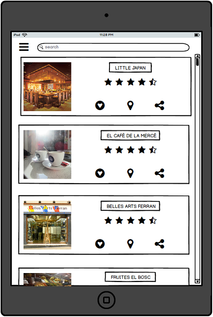

# BotiguesBCN - ESPECIFICACIÓ DE REQUISITS DEL SOFTWARE #

## 1. ESPECIFICACIÓ FUNCIONAL ##

### 1.1. Diagrama de casos d'ús

- Cas d'ús UC001 - *Log in*: Permet que l'usuari es pugui loguejar a l'aplicació.
- Cas d'ús UC002 - *Newsletter*: Permet que els usuaris puguin consultar els canvis recents en el sistema.
- Cas d'ús UC003 - *Visualitzar ruta*: Visualitza una ruta temàtica.
- Cas d'ús UC004 - *Consultar rutes temàtiques*: Permetrà buscar rutes temàtiques.
- Cas d'ús UC005 - *Compartir ruta visitada*: Permetrà compartir una ruta visitada entre els teus "amics".
- Cas d'ús UC007 - *Consultar Ofertes i descomptes*: Permetrà consultar les ofertes i els descomptes d'una botiga concreta.
- Cas d'ús UC008 - *Guardar botiga com a favorit*: Permetrà guardar una botiga en la teva llista de preferides.
- Cas d'ús UC009 - *Compartir experiències*: Permetrà compartir una experiència viscuda en un comerç/ruta temàtica.
- Cas d'ús UC010 - *Compartir botigua*: Permetrà compartir una botiga.
- Cas d'ús UC011 - *Valorar botigues*: Es ficarà una valoració sobre un establiment concret.
- Cas d'ús UC012 - *Donar Puntuació*: Donar puntuació a una valoració d'una botiga.
- Cas d'ús UC013 - *Fer Comentari*: Permetrà fer un comentari a una valoració d'una botiga.
- Cas d'ús UC014 - *Compartir Valoració*: Comparteix la valoració que s'ha donat a una botiga.
- Cas d'ús UC015 - *Llistar Botigues*: Et permet llistar les botigues.
- Cas d'ús UC016 - *Per descomptes*: Et permet llistar les botigues pels descomptes que es tenen.
- Cas d'ús UC017 - *Per tipus de botiga*: Et permet llistar les botigues pel tipus de botiga/temàtica.
- Cas d'ús UC018 - *Per proximitat*: Et permet llistar les botigues per proximitat.
- Cas d'ús UC019 - *Favorites*: Et permet llistar les botigues que tens com a preferides.
- Cas d'ús UC020 - *Demanar gestions del sistema*: El botiguer demana que es faci un canvi a la seva informació de la botiga.
- Cas d'ús UC021 - *Administrar rutes temàtiques*: Permet administrar rutes temàtiques del sistema.
- Cas d'ús UC022 - *Eliminar rutes*: Elimina una ruta temàtica.
- Cas d'ús UC023 - *Editar rutes*: Edita una ruta temàtica.
- Cas d'ús UC024 - *Afegir rutes*: Afegeix una ruta temàtica.
- Cas d'ús UC025 - *Gestionar Noticies*: Permet gestionar les notices en el Newsletter.
- Cas d'ús UC026 - *Editar Notícies*: Permet editar notícies en el Newsletter.
- Cas d'ús UC027 - *Afegir Notícies*: Permet afegir notícies en el Newsletter.
- Cas d'ús UC028 - *Eliminar Notícies*: Permet eliminar notícies en el Newsletter.
- Cas d'ús UC029 - *Veure auditories del sistema*: Permet visualitzar la llista de privilegis de cada usuari.
- Cas d'ús UC030 - *Administrar botigues*: Permet administrar les botigues del sistema.
- Cas d'ús UC031 - *Afegir botigues*: Afegeix una botiga.
- Cas d'ús UC032 - *Editar botigues*: Edita una botiga.
- Cas d'ús UC033 - *Eliminar botigues*: Elimina una botiga.

### 1.2. Descripció individual dels casos d'ús

#### Cas d'ús UC001 - *Log in* ####
	-	Descripció: Permet a l'usuari loguejar-se al sistema per a què pugui utilitzar totes les seves funcionalitats.
	-	Actor principal: Usuari.
	-	Precondicions: ---------------------
####Cas d'ús UC002 - *Newsletter*####
	-	Descripció: Permetrà a l'usuari, visualitzar/consultar totes les novetats que hi ha agut el sistema i els informa de les noves funcionalitats.
	-	Actor principal: Usuari.
	-	Precondicions: Haver loguejat (Cas d'ús UC001).
####Cas d'ús UC003 - *Visualitzar ruta*####
	-	Descripció: Permetrà visualitzar una ruta amb tots els detalls. Això inclou que es mostraran totes les botigues de la ruta, distància de la ruta, etc.
	-	Actor principal: Usuari.
	-	Precondicions: Haver loguejat (Cas d'ús UC001).
####Cas d'ús UC004 - *Consultar rutes temàtiques*####
	-	Descripció: Permetrà buscar rutes temàtiques.
	-	Actor principal: Usuari.
	-	Precondicions: Haver loguejat (Cas d'ús UC001).
####Cas d'ús UC005 - *Compartir ruta visitada*####
	-	Descripció: Permetrà compartir una ruta visitada entre les amistats que tinguis al sistema.
	-	Actor principal: Usuari.
	-	Precondicions: Haver loguejat (Cas d'ús UC001).
####Cas d'ús UC006 - *Visualitzar botiga*####
	-	Descripció: Permet visualitzar una botiga amb tots els seus detalls: Ubicació, nom, Distància, Valoració, etc.
	-	Actor principal: Usuari.
	-	Precondicions: Haver loguejat (Cas d'ús UC001).
####Cas d'ús UC007 - *Consultar Ofertes i descomptes*####
	-	Descripció: Permetrà visualitzar totes les ofertes i tots els descomptes d'una botiga concreta.
	-	Actor principal: Usuari.
	-	Precondicions: Haver loguejat (Cas d'ús UC001), Estar en la vista d'una botiga (Cas d'ús UC006).
####Cas d'ús UC008 - *Guardar botiga com a favorit*####
	-	Descripció: Permetrà guardar una botiga a la teva llista de botigues preferides. Després a l'hora de buscar-la ho tindràs més fàcil per trobar-la.
	-	Actor principal: Usuari.
	-	Precondicions: Haver loguejat (Cas d'ús UC001), Estar en la vista d'una botiga (Cas d'ús UC006).
####Cas d'ús UC009 - *Compartir experiències*####
	-	Descripció: Permetrà compartir una experiència viscuda, utilitzant el sistema, entre els teus amics. Tant sigui per compartir una experiència viscuda en una ruta, com una experiència viscuda en una botiga.
	-	Actor principal: Usuari.
	-	Precondicions: Haver loguejat (Cas d'ús UC001).
####Cas d'ús UC010 - *Compartir botiga*####
	-	Descripció: Permetrà compartir una botiga entre els teus amics.
	-	Actor principal: Usuari.
	-	Precondicions: Haver loguejat (Cas d'ús UC001).
####Cas d'ús UC011 - *Valorar botigues*####
	-	Descripció: Et permetrà valorar una botiga.
	-	Actor principal: Usuari.
	-	Precondicions: Haver loguejat (Cas d'ús UC001).
####Cas d'ús UC012 - *Donar Puntuació*####
	-	Descripció: Permet donar una puntuació a un negoci.
	-	Actor principal: Usuari.
	-	Precondicions: Haver loguejat (Cas d'ús UC001), Valorar una botiga (Cas d'ús UC011).
####Cas d'ús UC013 - *Fer Comentari*####
	-	Descripció: Permet fer un comentari d'un negoci.
	-	Actor principal: Usuari.
	-	Precondicions: Haver loguejat (Cas d'ús UC001), Valorar una botiga (Cas d'ús UC011).
####Cas d'ús UC014 - *Compartir Valoració*####
	-	Descripció: Permet compartir una valoració que s'hagi fet a un negoci.
	-	Actor principal: Usuari.
	-	Precondicions: Haver loguejat (Cas d'ús UC001), Valorar una botiga (Cas d'ús UC011).
####Cas d'ús UC015 - *Llistar Botigues*####
	-	Descripció: Et llista totes les botigues depenent d'un criteri de cerca.
	-	Actor principal: Usuari.
	-	Precondicions: Haver loguejat (Cas d'ús UC001).
####Cas d'ús UC016 - *Per descomptes*####
	-	Descripció: Es llistaràn les botigues depenent dels seus descomptes.
	-	Actor principal: Usuari.
	-	Precondicions: Haver loguejat (Cas d'ús UC001), Llistar les botigues (Cas d'ús UC015).
####Cas d'ús UC017 - *Per tipus de botiga*####
	-	Descripció: Es llistaràn les botigues depenent dels tipus de botiga.
	-	Actor principal: Usuari.
	-	Precondicions: Haver loguejat (Cas d'ús UC001), Llistar les botigues (Cas d'ús UC015).
####Cas d'ús UC018 - *Per proximitat*####
	-	Descripció: Es llistaràn les botigues depenent de la seva proximitat.
	-	Actor principal: Usuari.
	-	Precondicions: Haver loguejat (Cas d'ús UC001), Llistar les botigues (Cas d'ús UC015).
####Cas d'ús UC019 - *Favorites*####
	-	Descripció: Es llistaràn les botigues que tinguis guardades com a preferides.
	-	Actor principal: Usuari.
	-	Precondicions: Haver loguejat (Cas d'ús UC001), Llistar les botigues (Cas d'ús UC015).
####Cas d'ús UC020 - *Demanar gestions del sistema*####
	-	Descripció: Les botigues demana una gestió de la seva botiga a l'administrador.
	-	Actor principal: Botigues, Administrador.
	-	Precondicions: ---------------------
####Cas d'ús UC021 - *Administrar rutes temàtiques*####
	-	Descripció: S'administren les rutes temàtiques.
	-	Actor principal: Administrador.
	-	Precondicions: ---------------------
####Cas d'ús UC022 - *Eliminar rutes*####
	-	Descripció: S'elimina una ruta temàtica.
	-	Actor principal: Administrador.
	-	Precondicions: Adminstrar una ruta temàtica (Cas d'ús UC021).
####Cas d'ús UC023 - *Editar rutes*####
	-	Descripció: S'edita una ruta temàtica.
	-	Actor principal: Administrador.
	-	Precondicions: Adminstrar una ruta temàtica (Cas d'ús UC021).
####Cas d'ús UC024 - *Afegir rutes*####
	-	Descripció: S'afegeix una ruta temàtica.
	-	Actor principal: Administrador.
	-	Precondicions: Adminstrar una ruta temàtica (Cas d'ús UC021).
####Cas d'ús UC025 - *Gestionar noticies*####
	-	Descripció: Es gestionen notícies del Newsletter.
	-	Actor principal: Administrador.
	-	Precondicions: ---------------------
####Cas d'ús UC026 - *Editar noticies*####
	-	Descripció: S'editen noticies del Newsletter.
	-	Actor principal: Administrador.
	-	Precondicions: ---------------------
####Cas d'ús UC027 - *Afegir noticies*####
	-	Descripció: S'afegeixen notícies al Newsletter.
	-	Actor principal: Administrador.
	-	Precondicions: ---------------------
####Cas d'ús UC028 - *Eliminar noticies*####
	-	Descripció: S'eliminen noticies del Newsletter.
	-	Actor principal: Administrador.
	-	Precondicions: ---------------------
####Cas d'ús UC029 - *Veure auditories del sistema*####
	-	Descripció: Permet visualitzar la llista de privilegis que té cada usuari del sistema.
	-	Actor principal: Administrador.
	-	Precondicions: ---------------------
####Cas d'ús UC030 - *Administrar botigues*####
	-	Descripció: S'administren les rutes temàtiques.
	-	Actor principal: Administrador.
	-	Precondicions: ---------------------
####Cas d'ús UC031 - *Afegir botigues*####
	-	Descripció: S'afegeix una botiga.
	-	Actor principal: Administrador.
	-	Precondicions: Administrar una botiga (Cas d'ús UC027).
####Cas d'ús UC032 - *Editar botigues*####
	-	Descripció: S'edita les dades una botiga.
	-	Actor principal: Administrador.
	-	Precondicions: Administrar una botiga (Cas d'ús UC027).
####Cas d'ús UC033 - *Eliminar botigues*####
	-	Descripció: S'elimina una botiga.
	-	Actor principal: Administrador.
	-	Precondicions: Administrar una botiga (Cas d'ús UC027).

## 2. ESPECIFICACIÓ NO FUNCIONAL ##

####1. *Aparença*####
	-	Tipus de Requisit: No funcional.
	-	Descripció: El nostre producte haurà de fer que els seus usuàris el comencin a utilitzar rapidament. Amb això hem refereixo a què els usuaris s'hauràn de veure atrets per aquest producte al cap poc temps d'haver entrat en contacte amb ell. Si els usuaris no es veuen atrets per l'aparença del producte, aleshores aquest no tindrà cap utilitat.
	-	Justificació del requisit: El necessitem per a què els usuaris es vegin atrets.
	-	Criteri de validació: Si els usuaris es veuen atrets, utilitzaran més el nostre sistema, cosa que farà que el comencin a utilitzar rapidament.

####2. *Estil*####
	-	Tipus de Requisit: No funcional.
	-	Descripció: El producte haurà de tindre un estil concret, adient en el seu àmbit. Si el producte no té un estil adequat, pot ser que els seus usuaris no es sentin segurs a l'hora d'utilitzar-lo, i de la mateixa forma que en l'aparença, pot ser que el deixin d'utilitzar.
	-	Justificació del requisit: El nostre producte a de tindre un estil que s'adapti a totes els usuaris, tant siguin persones grans com joves.
	-	Criteri de validació: Si s'adapta bé a tots els públics, el nostre sistema s'utilitzarà més, i al mateix temps, els seus usuaris es sentiran còmodes utilitzant-lo.

####3. *Usable*####
	-	Tipus de Requisit: No funcional.
	-	Descripció: La nostra aplicació haurà de ser usable. Amb la paraula usable, ens referim a que la nostra aplicació haurà d'oferir als usuaris una forma fàcil d'interactuar amb el sistema, ja sigui a partir d'una interfície gràfica on tot es vegi amb claredat, com que els usuaris no els calgui interaccionar gaire amb el sistema per trobar allò que estan buscant.
	-	Justificació del requisit: El sistema no s'ha de fer pesat, per aquest motiu, s'ha de facilitar el seu ús.
	-	Criteri de validació: Si no és usable, pot ser que els seus usuaris es cansin d'utilitzar el sistema pel simple fet que es triga molt en utilitzar.

####4. *Internacional*####
	-	Tipus de Requisit: No funcional.
	-	Descripció: Per satisfer la comoditat dels nostres usuaris, el nostre producte haurà de permetre que els usuaris puguin seleccionar entre una llista de diferents llengües.
	-	Justificació del requisit: El sistema necessitarà poder ser utilitzat per usuaris d'altres llocs, per tant, ha de ser internacional.
	-	Criteri de validació: Si no és internacional, es perdrà molta gent, ja que no l'utilitzarà.

####5. *Comprensible*####
	-	Tipus de Requisit: No funcional.
	-	Descripció: El producte utilitzarà símbols que puguin ser reconeguts per la majoria de gent, ho sigui, tothom que vulgui podrà entendre els símbols de la nostra aplicació.
	-	Justificació del requisit: El sistema ha de poder ser entenible per tots els usuaris possibles.
	-	Criteri de validació: Si els usuaris no entenen el caràcter del sistema, no l'utilitzaràn.

####6. *Cortesia*####
	-	Tipus de Requisit: No funcional.
	-	Descripció: Els usuaris no podran veure, en cap moment, com està implementat el sistema, ja que sinó el podria utilitzar la competència o es podrà per un mal ús de l'aplicació.
	-	Justificació del requisit: El sistema no s'ha de poder hackejar.
	-	Criteri de validació: Si el sistema es pot hackejar, aleshores els usuaris no es sentiràn segurs.

####7. *Accesibilitat*####
	-	Tipus de Requisit: No funcional.
	-	Descripció: Per poder estar a l'abast de tothom, el nostre producte estarà disponible per gent discapacidada, per exemple, amb una interacció oral/auditiva amb el dispositiu per a les persones vidents.
	-	Justificació del requisit: El sistema ha de poder ser accessible per quasi tothom.
	-	Criteri de validació: la gent que no hi tingui accés, no podrà utilitzar el sistema.

####8. *Velocitat*####
	-	Tipus de Requisit: No funcional.
	-	Descripció: Per satisfer a l'usuari, el nostre producte haurà de satisfer un mínim de velocitat d'interacció amb l'usuari.
	-	Justificació del requisit: El sistema ha de permetre que els usuaris facin les gestions de forma ràpida.
	-	Criteri de validació: Si no es fan les gestions ràpides, el sistema es pot tornar molt pesat.

####9. *Seguretat*####
	-	Tipus de Requisit: No funcional.
	-	Descripció: Els usuaris, en cap moment podran visualitzar o modificar dades privades d'altres perfils d'usuaris o dels perfils dels comerços. Aquests només es podran modificar per sol·licitud del comerç i ho farà un consultor.
	-	Justificació del requisit: El sistema ha de ser segur.
	-	Criteri de validació: Si el sistema no és segur, els usuaris en podrien fer un mal ús, i els que no ho fecin, es podrien sentir desprotegits.

####10. *Disponibilitat*####
	-	Tipus de Requisit: No funcional.
	-	Descripció: El producte estarà disponible les 24 hores del dia, tots els dies de l'any, exceptuant els moments que es trobi en manutenció. Els seus usuaris podran disfrutar d'ell sempre que vulguin en el moment que vulguin.
	-	Justificació del requisit: El sistema ha d'estar disponible sempre i quan sigui possible.
	-	Criteri de validació: Si el sistema no esta disponible, els usuaris no el podran utilitzar.

####11. *Fortaleza*####
	-	Tipus de Requisit: No funcional.
	-	Descripció: El producte guardarà una part de les dades del núbol en el nostre dispositiu, de forma que quan aquest es trobi sense internet, el nostre usuari podrà continuar interactuant, de forma limitada, amb el sistema.
	-	Justificació del requisit: El sistema s'ha de poder accedir sense tindre internet.
	-	Criteri de validació: Si el sistema no es pot accedir sense internet, els usuaris no podran accedir al sistema.

####12. *Capacitat*####
	-	Tipus de Requisit: No funcional.
	-	Descripció: Per tal que tots els usuaris pugui utilitzar el producte, aquest permetrà l'accès simultani de 20000 persones.
	-	Justificació del requisit: El sistema ha de permetre que els usuaris accedeixin a la vegada.
	-	Criteri de validació: Si el sistema no permet que hi hagi un aforament bastant gran, pot ser que hi hagi usuaris que no hi puguin accedir.

####13. *Interfície*####
	-	Tipus de Requisit: No funcional.
	-	Descripció: Per que l'usuari pugui consultar tots els comerços i rutes que l'envolten, el nostre producte permetrà una conecció amb altres sistemes per poder geolocalitzar l'ubicació en que es troba l'usuari.
	-	Justificació del requisit: El sistema he de permetre que la informació es mostri mitjançant altres interficíes.
	-	Criteri de validació: Si no hi ha interacció amb altres sistemes, hi haurà funcionalitats que no es podran dur a terme.

####14. *Manteniment*####
	-	Tipus de Requisit: No funcional.
	-	Descripció: El producte permetrà que els seus usuaris actualitzin les seves dades i que els botiguers puguin penjar ofertes en tot moment.
	-	Justificació del requisit: El sistema ha de tindre les dades actualitzades.
	-	Criteri de validació: Si les dades no estan actualitzades, aleshores la informació estaria errònia.

####15. *Suport*####
	-	Tipus de Requisit: No funcional.
	-	Descripció: El producte oferirà servei de suport les 24 hores tots els dies de l'any per si els usuaris o els botiguers tenen algun problema.
	-	Justificació del requisit: El sistema a d'oferir servei de suport per qualsevol problema que pugui sorgir durant la seva utilització.
	-	Criteri de validació: Si algun usuari té un problema i no té suport, l'usuari no podrà resoldre el problema.

####16. *Adaptabilitat*####
	-	Tipus de Requisit: No funcional.
	-	Descripció: El producte estarà disponible per Windows Phone, IOS, Andrioid i tindrà servei web, per tal que els usuaris no quedin restringits per l'arquitectura dels seus dispositius.
	-	Justificació del requisit: El sistema s'ha de poder utilitza des de diferents plataformes.
	-	Criteri de validació: Si el sistema no és apte per algunes plataformes, els usuaris que les utilitzen no podran utilitzar el sistema.

####17. *Integritat*####
	-	Tipus de Requisit: No funcional.
	-	Descripció: El producte haurà de prevenir la introducció de dades incorrectes, per tal que aquestes no puguin ocasionar problemes més endavant.
	-	Justificació del requisit: El sistema sempre ha de mostrar dades que siguin correctes.
	-	Criteri de validació: Si no es prevé de que les dades siguin incorrectes, aleshores no tenim la fiabilitat de que aquestes estiguin actualitzades i correctes en tot moment.

####18. *Privacitat*####
	-	Tipus de Requisit: No funcional.
	-	Descripció: Els usuaris s'informaran de tots els usos que tindran les seves dades, inclús quan es facin actualitzacions que requereixin de més funcions diferents. D'aquesta forma l'usuari sempre pot triar si fer servir o no el sistema depenent de l'ús que es pugui donar a aquestes dades.
	-	Justificació del requisit: Els usuaris han d'estar informats de l'ús de les seves dades.
	-	Criteri de validació: Si els usuaris no estan informats sobre l'ús de les seves dades, aleshores, es podria generar desconfiança.

## 2. MockUps##

Llista Botigues:

Llista Rutes Temàtiques:

Vista Botiga:

Vista Perfil:

