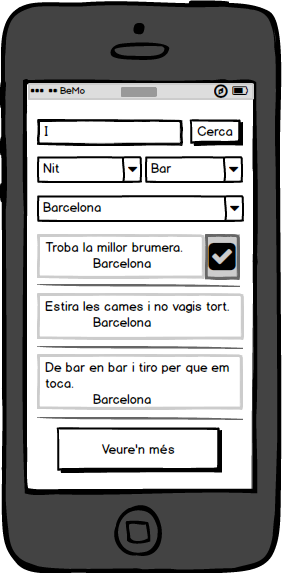
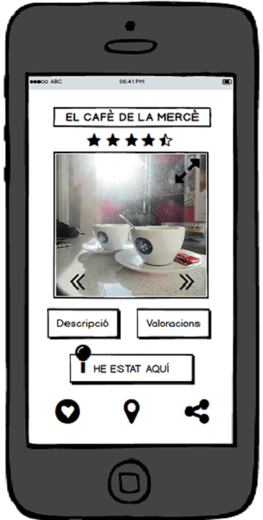
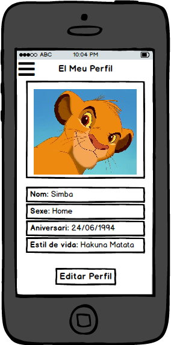

# BotiguesBCN - ESPECIFICACIÓ DE REQUISITS DEL SOFTWARE #

> El propòsit del document d'especificació de requisits és presentar el detall dels requisits del sistema. És un document evolutiu, atès que el nombre i detall dels requisits creix a mida que s'avança en el projecte

> Donat el principi de "dirigit per casos d'ús", l'especificació funcional pendrà la forma d'una especificació per casos d'ús

> Recordem que els documents de visió i cas de negoci tindran força informació sobre el producte, que aquí no repetirem

## 1. ESPECIFICACIÓ FUNCIONAL ##

### 1.1. Diagrama de casos d'ús

> Diagrama UML clàssic. És important mantenir la consistència amb altres documents, per exemple els actors del diagrama han de ser un subconjunt de les parts interessades establertes al document de visió (i més coses...)

> Si creieu que us ajuda a la legibilitat, podeu agrupar casos d'ús similars en paquets

- Cas d'ús UC001 - *Log in*:
	-	Descripció:
	-	Actor principal:
	-	Precondicions:
	-	Disparador:
- Cas d'ús UC002 - *Newsletter*:
	-	Descripció:
	-	Actor principal:
	-	Precondicions:
	-	Disparador:
- Cas d'ús UC003 - *Visualitzar ruta*:
	-	Descripció:
	-	Actor principal:
	-	Precondicions:
	-	Disparador:
- Cas d'ús UC004 - *Consultar rutes temàtiques*:
	-	Descripció:
	-	Actor principal:
	-	Precondicions:
	-	Disparador:
- Cas d'ús UC005 - *Compartir ruta visitada*:
	-	Descripció:
	-	Actor principal:
	-	Precondicions:
	-	Disparador:
- Cas d'ús UC006 - *Visualitzar botiga*:
	-	Descripció:
	-	Actor principal:
	-	Precondicions:
	-	Disparador:
- Cas d'ús UC007 - *Consultar Ofertes i descomptes*:
	-	Descripció:
	-	Actor principal:
	-	Precondicions:
	-	Disparador:
- Cas d'ús UC008 - *Guardar botiga com a favorit*:
	-	Descripció:
	-	Actor principal:
	-	Precondicions:
	-	Disparador:
- Cas d'ús UC009 - *Compartir experiències*:
	-	Descripció:
	-	Actor principal:
	-	Precondicions:
	-	Disparador:
- Cas d'ús UC010 - *Compartir botigua*:
	-	Descripció:
	-	Actor principal:
	-	Precondicions:
	-	Disparador:
- Cas d'ús UC011 - *Valorar botigues*:
	-	Descripció:
	-	Actor principal:
	-	Precondicions:
	-	Disparador:
- Cas d'ús UC012 - *Donar Puntuació*:
	-	Descripció:
	-	Actor principal:
	-	Precondicions:
	-	Disparador:
- Cas d'ús UC013 - *Fer Comentari*:
	-	Descripció:
	-	Actor principal:
	-	Precondicions:
	-	Disparador:
- Cas d'ús UC014 - *Compartir Valoració*:
	-	Descripció:
	-	Actor principal:
	-	Precondicions:
	-	Disparador:
- Cas d'ús UC015 - *Llistar Botigues*:
	-	Descripció:
	-	Actor principal:
	-	Precondicions:
	-	Disparador:
- Cas d'ús UC016 - *Per descomptes*:
	-	Descripció:
	-	Actor principal:
	-	Precondicions:
	-	Disparador:
- Cas d'ús UC017 - *Per tipus de botiga*:
	-	Descripció:
	-	Actor principal:
	-	Precondicions:
	-	Disparador:
- Cas d'ús UC018 - *Per proximitat*:
	-	Descripció:
	-	Actor principal:
	-	Precondicions:
	-	Disparador:
- Cas d'ús UC019 - *Favorites*:
	-	Descripció:
	-	Actor principal:
	-	Precondicions:
	-	Disparador:
- Cas d'ús UC020 - *Demanar gestions del sistema*:
	-	Descripció:
	-	Actor principal:
	-	Precondicions:
	-	Disparador:
- Cas d'ús UC021 - *Administrar rutes temàtiques*:
	-	Descripció:
	-	Actor principal:
	-	Precondicions:
	-	Disparador:
- Cas d'ús UC022 - *Eliminar rutes*:
	-	Descripció:
	-	Actor principal:
	-	Precondicions:
	-	Disparador:
- Cas d'ús UC023 - *Editar rutes*:
	-	Descripció:
	-	Actor principal:
	-	Precondicions:
	-	Disparador:
- Cas d'ús UC024 - *Afegir rutes*:
	-	Descripció:
	-	Actor principal:
	-	Precondicions:
	-	Disparador:
- Cas d'ús UC025 - *Afegir noticia*:
	-	Descripció:
	-	Actor principal:
	-	Precondicions:
	-	Disparador:
- Cas d'ús UC026 - *Veure auditories del sistema*:
	-	Descripció:
	-	Actor principal:
	-	Precondicions:
	-	Disparador:
- Cas d'ús UC027 - *Administrar botigues*:
	-	Descripció:
	-	Actor principal:
	-	Precondicions:
	-	Disparador:
- Cas d'ús UC028 - *Afegir botigues*:
	-	Descripció:
	-	Actor principal:
	-	Precondicions:
	-	Disparador:
- Cas d'ús UC029 - *Editar botigues*:
	-	Descripció:
	-	Actor principal:
	-	Precondicions:
	-	Disparador:
- Cas d'ús UC030 - *Eliminar botigues*:
	-	Descripció:
	-	Actor principal:
	-	Precondicions:
	-	Disparador:

### 1.2. Descripció individual dels casos d'ús

#### Cas d'ús UC001 - *Log in* ####
	-	Descripció:
	-	Actor principal:
	-	Precondicions:
	-	Disparador:
####Cas d'ús UC002 - *Newsletter*####
	-	Descripció:
	-	Actor principal:
	-	Precondicions:
	-	Disparador:
####Cas d'ús UC003 - *Visualitzar ruta*####
	-	Descripció:
	-	Actor principal:
	-	Precondicions:
	-	Disparador:
####Cas d'ús UC004 - *Consultar rutes temàtiques*####
	-	Descripció:
	-	Actor principal:
	-	Precondicions:
	-	Disparador:
####Cas d'ús UC005 - *Compartir ruta visitada*####
	-	Descripció:
	-	Actor principal:
	-	Precondicions:
	-	Disparador:
####Cas d'ús UC006 - *Visualitzar botiga*####
	-	Descripció:
	-	Actor principal:
	-	Precondicions:
	-	Disparador:
####Cas d'ús UC007 - *Consultar Ofertes i descomptes*####
	-	Descripció:
	-	Actor principal:
	-	Precondicions:
	-	Disparador:
####Cas d'ús UC008 - *Guardar botiga com a favorit*####
	-	Descripció:
	-	Actor principal:
	-	Precondicions:
	-	Disparador:
####Cas d'ús UC009 - *Compartir experiències*####
	-	Descripció:
	-	Actor principal:
	-	Precondicions:
	-	Disparador:
####Cas d'ús UC010 - *Compartir botigua*####
	-	Descripció:
	-	Actor principal:
	-	Precondicions:
	-	Disparador:
####Cas d'ús UC011 - *Valorar botigues*####
	-	Descripció:
	-	Actor principal:
	-	Precondicions:
	-	Disparador:
####Cas d'ús UC012 - *Donar Puntuació*####
	-	Descripció:
	-	Actor principal:
	-	Precondicions:
	-	Disparador:
####Cas d'ús UC013 - *Fer Comentari*####
	-	Descripció:
	-	Actor principal:
	-	Precondicions:
	-	Disparador:
####Cas d'ús UC014 - *Compartir Valoració*####
	-	Descripció:
	-	Actor principal:
	-	Precondicions:
	-	Disparador:
####Cas d'ús UC015 - *Llistar Botigues*####
	-	Descripció:
	-	Actor principal:
	-	Precondicions:
	-	Disparador:
####Cas d'ús UC016 - *Per descomptes*####
	-	Descripció:
	-	Actor principal:
	-	Precondicions:
	-	Disparador:
####Cas d'ús UC017 - *Per tipus de botiga*####
	-	Descripció:
	-	Actor principal:
	-	Precondicions:
	-	Disparador:
####Cas d'ús UC018 - *Per proximitat*####
	-	Descripció:
	-	Actor principal:
	-	Precondicions:
	-	Disparador:
####Cas d'ús UC019 - *Favorites*####
	-	Descripció:
	-	Actor principal:
	-	Precondicions:
	-	Disparador:
####Cas d'ús UC020 - *Demanar gestions del sistema*####
	-	Descripció:
	-	Actor principal:
	-	Precondicions:
	-	Disparador:
####Cas d'ús UC021 - *Administrar rutes temàtiques*####
	-	Descripció:
	-	Actor principal:
	-	Precondicions:
	-	Disparador:
####Cas d'ús UC022 - *Eliminar rutes*####
	-	Descripció:
	-	Actor principal:
	-	Precondicions:
	-	Disparador:
####Cas d'ús UC023 - *Editar rutes*####
	-	Descripció:
	-	Actor principal:
	-	Precondicions:
	-	Disparador:
####Cas d'ús UC024 - *Afegir rutes*####
	-	Descripció:
	-	Actor principal:
	-	Precondicions:
	-	Disparador:
####Cas d'ús UC025 - *Afegir noticia*####
	-	Descripció:
	-	Actor principal:
	-	Precondicions:
	-	Disparador:
####Cas d'ús UC026 - *Veure auditories del sistema*####
	-	Descripció:
	-	Actor principal:
	-	Precondicions:
	-	Disparador:
####Cas d'ús UC027 - *Administrar botigues*####
	-	Descripció:
	-	Actor principal:
	-	Precondicions:
	-	Disparador:
####Cas d'ús UC028 - *Afegir botigues*####
	-	Descripció:
	-	Actor principal:
	-	Precondicions:
	-	Disparador:
####Cas d'ús UC029 - *Editar botigues*####
	-	Descripció:
	-	Actor principal:
	-	Precondicions:
	-	Disparador:
####Cas d'ús UC030 - *Eliminar botigues*####
	-	Descripció:
	-	Actor principal:
	-	Precondicions:
	-	Disparador:

## 2. ESPECIFICACIÓ NO FUNCIONAL ##

> Descriure en més detall els requisits no funcionals que han sortit al document de visió, intentant fer-los el més quantificables possible. Basar-se en alguna plantilla d'especificació de requisits

1. *Aparença*. El nostre producte haurà de fer que els seus usuaries el comencin a utilitzar rapidament. Amb aixó hem refereixo a que els usuaris s'hauràn de veure atrets per aquest producte al poc temps d'haver entrat en contacte amb ell. Si els usuaris no es veuen atrets per l'aparença del producte, aleshores aquest no tindrà cap utilitat.

2. *Estil*. El producte haurà de tindre un estil concret, adient en el seu àmbit. Si el producte no té un estil adequat, pot esser que els seus usuaris no es sentin segurs a l'hora d'utilitzar-lo, i de la mateixa forma que en l'aparença, pot esser que el deixun d'utilitzar.

3. *Usable*. La nostra aplicació haurà de ser usable. Amb la paraula usable, ens referim a que la nostra aplicació haurà d'oferir als usuaris una forma fàcil d'interactuar amb el sistema, ja sigui a partir d'una interficie gràfica on tot es veigui amb claredat, com que els usuaris no els calgui interaccionar gaire amb el sistema per trobar alló que estan buscant.

4. *Internacional*. Per satisfer la comoditat dels nostres usuaris, el nostre producte haurà de permetre que els usuaris puguin seleccionar entre una llista de diferents llengües.

5. *Comprensible*. El producte utilitzarà sibols que puguin ser reconeguts per la majoria de gent, ho sigui, tothom que vulgui podrà entendre els simbols de la nostra aplicació.

6. *Cortesia*. Els usuaris no podran veure, en cap moment, com està implementat el sistema, ja que sinó el podría utilitzar la competencia o es podra per un mal ús de l'aplicació.

7. *Accesibilitat*. Per poder estar a l'abast de tothom, el nostre producte estarà disponible per gent descapacidada, per exemple, amb una interacció oral/auditiva amb el dispositiu per a les persones vidents.

8. *Velocitat*. Per satisfer a l'usuari, el nostre producte haurà de satisfer un mínim de velocitat d'interacció amb l'usuari.

9. *Seguretat*. Els usuaris, en cap moment podràn visualitzar o modificar dades privades d'altres perfils d'usuaris o dels perfils dels comerços. Aquests només es podràn modificar per solicitud del comerç i ho fara un consultor.

10. *Disponibilitat*. El producte estarà disponible les 24 hores del dia, tots els dies de l'any, exceptuant els moments que es trovi en manutenció. Els seus usuaris podràn disfrutar d'ell sempre que vulguin en el moment que vulguin.

11. *Fortaleza*. El producte guardarà una part de les dades del nubol en el nostre dispositiu, de forma que quan aquest es trobi sense internet, el nostre usuari podrà continuar interactuant, de forma limitada, amb el sistema.

12. *Capacitat*. Per tal que tots els usuaris pugui utilitzar el producte, aquest permetrà l'acces simultani de 20000 pesones.

13. *Interficie*. Per que l'usuari pugui consultar tots els comerços i rutes que l'envolten, el nostre producte permetrà una connecció amb altres sistemes per poder geolocalitzar l'ubicació en que es troba l'usuari.

14. *Manteniment*. El producte permetrà que els seus usuaris actualitzin les seves dades i que els botiguers puguin penjar ofertes en tot moment.

15. *Suport*. El producte ofereirà servei de soport les 24 hores tots els dies de l'any per si els usuaris o els botiguers tenen algun problema.

16. *Adaptabilitat*. El producte estarà disponible per Windows Phone, IOS, Andrioid i tindrà servei web, per tal que els usuaris no quedin restringits per l'arquitectura dels seus dispositius.

17. *Integritat* El producte haurà de previndre l'introducció de dades incorrectes, per tal que aquestes no pugiin ocasionar problemes més endavant.

18. *Privacitat* Els usuaris s'informaràn de tots els usos que tindràn les seves dades, inclús quan es facin actualitzacions que requereixin de més funcions diferents. D'aquesta forma l'usuari sempre pot triar si fer servir o no el sistema depenent de l'ús que es pugui donar a aquestes dades.

## 2. MockUps##

Llista Botigues:

Llista Rutes Temàtiques:

Vista Botiga:

Vista Perfil:

