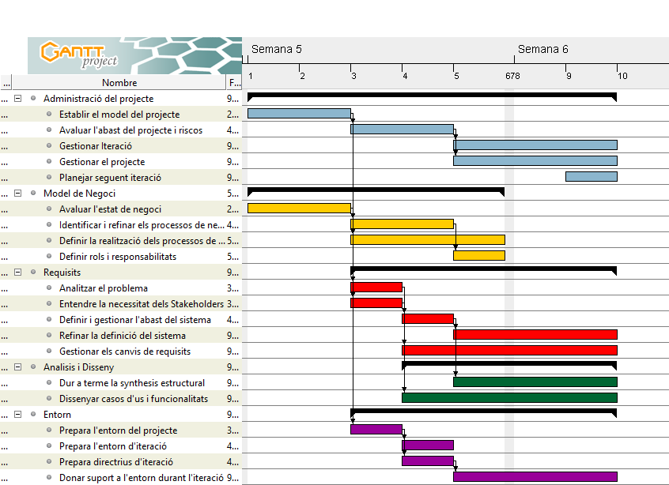

# BotiguesBCN - PLA D'ITERACIÓ Inception-I1 #

## 1. PRESENTACIÓ DE LA ITERACIÓ ##

L'iteració d'Inception, I1, es dura a terme del 1 al 9 de Febrer (7 dies laborables)

En la següent taula es mostra l'esforç de cada rol per aquesta iteració.

|Rol|Esforç|
|:---|:---:|
|Cap de Projecte|19%|
|Arquitecte|10%|
|Analista Funcional|35%|
|Analista de Xarxes|3%|
|Dissenyador|30%|
|Administrador de Bases de Dades|3%|
|Programador Senior|0%|
|Tester|0%|

## 2. COBERTURA DE CASOS D'ÚS ##

|Num|Iteració 1|
|---|---|
|1.| Identificat|
|2.|-|
|3.|Identificat|
|4.|Identificat|
|5.|-|
|6.|Identificat|
|7.|Identificat|
|8.|Identificat|
|9.|Identificat|
|10.|Identificat|
|11.|Identificat|
|12.|Identificat|
|13.|Identificat|
|14.|-|
|15.|-|

## 3. ACTIVITATS ##

Les diferents actvitats de la iteració T1 que estableixen la primera fase del projecte, mostren els següents resultats:

### A. Administració del Projecte ###

nº|Activitat|Esforç|Temps Esperat(dies)
:---|:---|:---:|:---:
1|Establir el model del projecte|18,18%|2
2|Avaluar el projecte i l'abast dels riscos|18,18%|2
3|Gestionar Iteració|27,27%|3
4|Gestionar el projecte|27,27%|3
5|Planejar seguent iteració|9,09%|1

Precedencies d'aquestes activitats

### B. Model de Negoci ###

nº|Activitat|Esforç|Temps Esperat(dies)
:---|:---|:---:|:---:
1|Avaluar l'estat de negoci|25%|2
2|Identificar i refinar els processos de negoci|25%|2
3|Definir la realització dels processos de negoci|37,5%|3
4|Definir rols i responsabilitats|12,5%|1

### C. Requisits ###

nº|Activitat|Esforç|Temps Esperat
:---|:---|:---:|:---:
1|Analitzar el problema|10%|1
2|Entendre la necessitat dels Stakeholders|10%|1
3|Definir i gestionar l'abast del sistema|10%|1
4|Refinar la definició del sistema|30%|3
5|Gestionar els canvis de requisits|40%|4

### D. Analisis i Disseny ###

nº|Activitat|Esforç|Temps Esperat
:---|:---|:---:|:---:
1|Dur a terme la synthesis estructural|42,85%|3
2|Dissenyar casos d'us i funcionalitats|57,14%|4

### E.  Entorn ###

nº|Activitat|Esforç|Temps Esperat
:---|:---|:---:|:---:
1|Prepara l'entorn del projecte|16%|1
2|Prepara l'entorn d'iteració|16%|1
3|Prepara directrius d'iteració|16%|1
4|Donar suport a l'entorn durant l'iteració|50%|3

## 4. DIAGRAMA DE GANTT ##

> Feu el diagrama de Gantt amb tota la informació necessària (dates, personal, fites, precedències, ...). Feu també el diagrama de PERT per discernir el temps mínim i màxim d'execució

