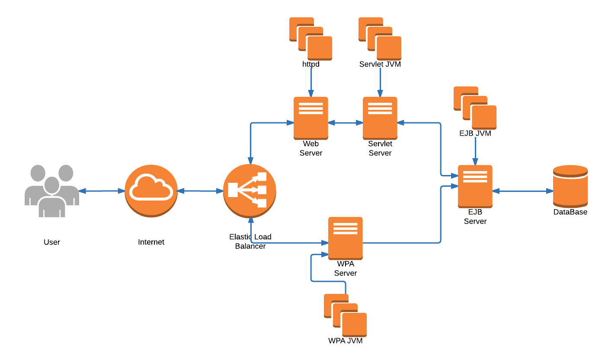

# BotiguesBCN - VISIÓ #

## 1. INTRODUCCIÓ ##

L’aplicació consistirà en una gran bases de dades, on s’emmagatzemarà tota la informació dels **petits comerços de Barcelona**. Aquests comerços estaran classificats en diferents categories segons els productes que ofereixin.

Els usuaris de l’aplicació, podran fer servir-la per trobar els petits comerços de proximitat. A més, l’usuari podrà interactuar amb les xarxes socials a partir de l’aplicació, per compartir les experiències que ha tingut en els petits comerços.

## 2. EL PROBLEMA ##

Durant l'última dècada  s'ha donat el cas en el què hem passat d'un tipus de comerç de barri i proper al client, a l'expansió de multinacionals i grans cadenes centralitzades sobretot en centres comercials. D'aquesta manera s'ha deixat de banda tots els petits comerços que es troben a peu de carrer, ja que per competència de les grans cadenes o comoditat dels usuaris per trobar-ho tot junt, barat i gastant el menor temps possible, han hagut de tancar-s'en molts. És per això que a partir d'aquest projecte volem aconseguir els següents fets:

- Es vol promocionar el petit comerç de la ciutat de Barcelona. 
- Afavorir als comerciants la promoció  i venda del seu producte.
- Que el ciutadà pugui conèixer el petit comerç de la seva ciutat, barri o proximitat. 
- Afavorir l’entreteniment.
- Incentivar la compra de proximitat i revifar alguns barris de la ciutat. 
- Afavorir el moviment de capital entre els petits comerços. 

## 3. PARTS INTERESSADES ##

1. **Comerciants.** Permetria una promoció del seu negoci i afavorir a integrar-se a Internet, i també, a les xarxes socials.
2. ** Clients.** Ajudaria els clients a trobar i conèixer petits comerços de la ciutat i obtenir noves ofertes i descomptes.
3. **Ajuntament.** Reactivaria el petit comerç a la ciutat de Barcelona. Ajudaria al pla “Smart City” de Barcelona.
4. **Treballadors del sector App.** L’aplicació obligaria una gestió i manteniment de l'App per part de Ajuntament.
5. **Proveïdors.** A l'augmentar el petit comerç crearia més necessitat per part del comerciant de disposar de més estoc.

## 4. EL PRODUCTE ##

### 4.1. Perspectiva del producte ###

Es tracta d'un sistema d’informació, que disposa d'una BD que conté tota la informació dels petits comerços. Disposaria d'una APP per mòbil i d'una web que mostra aquesta informació. 

### 4.2. Descripció del producte ###

1. **Llista de comerços.** Disposar d'un llistat de tots els comerços adherits a l'App.
2. **Mapa de comerços.** Fer servir la tecnologia GPS i Maps per mostrar els comerços pròxims a l'usuari de l'App.
3. **Interacció xarxes socials.** Donar la possibilitat de compartir l'experiència a través de les xarxes socials (Twitter, Facebook...)
4. **Perfil del comerç.** Cada comerç  disposarà d'un perfil amb informació que veuran els usuaris de l'App.
5. **Tags estat.** En el perfil de comerç hi hauran uns tags per definir diversos estats d'aquest comerç. Com podrien ser: Rebaixes, Liquidació, Tancat, Obert...
6. **Rutes temàtiques.** L'usuari disposara de l'opció de fer rutes temàtiques pels comerços. Aquestes rutes variaren depenen de les estacions, celebracions...
7. **Reviews, valoracions i favorits de comerços.** L'usuari tindrà l'opció de fer valoracions o reviews del comerç i així mateix, poder guardar-lo com a favorit.
8. **Descomptes exclusius.** Com a exclusivitat de l'App, l'usuari rebrà descomptes exclusius pels comerços adherits.
9. **Newsletter correu.** Setmanalment s'enviara una newsletter amb informació dels comerços (noves apertures, nous comerços adherits, ofertes...).

### 4.3. Supòsits de funcionament ###

1. ** Accés a Internet.** Tant a la pàgina web com a l'app. En el cas de l'app, es necessita una connexió a internet per guardar a caché la informació que hagi consultat, d'aquesta manera l'app no ocupará gran espai al dispositiu móbil.
2. **Sistemes Operatius nessaris: **Android, iOS i Windows Phone. Són els únics que ens ofereixen una API estable, sobretot amb la ubicació i gestió de mapes.

### 4.4. Dependències sobre altres sistemes ###

1. **Google Maps.** API d'una plataforma de localització d'ubicacions i consulta de mapes.
2. **Facebook, Twitter, Instagram i més xarxes socials.** La nostra app necessitarà la utilització d'aquestes eines per poder compartir les accions que es duen a terme
3. **Telerik.** Plataforma que ajuda a poder desenvolupar l'app de mòbil en els diferents sistemes operatius que existeixen.

### 4.5. Altres requisits ###

1. **Aparença**. El producte ha de ser atractiu per a tots els seus usuaris.
2. **Estil**. El producte haurà de mostrar un estil que atregui més usuaris.
3. **Usable**. El producte ha de ser fàcil d'utilitzar per a tots els seus usuaris.
4. **Internacional**. El producte permetrà que els seus usuaris puguin triar el llenguatge.
5. **Comprensible**. El producte utilitzarà símbols i paraules comprensibles per tots els seus usuaris.
6. **Cortesia**. L'usuari no mostrarà als seus usuaris com ha estat implementat.
7. **Accesibilitat**. El producte serà usable per a persones amb discapacitats, com ara vidents.
8. **Velocitat**. El producte permetrà a l'usuari fer les consultes/accions en un temps suficientment ràpid.
9. **Seguretat**. Les dades dels usuaris estaràn protegides en tot moment de qualsevol persona que no estigui autoritzada per visualitzar-les.
10. **Disponibilitat**. El producte estarà disponible les 24 hores del dia, tots els dies de l'any, exceptuant els moments que es trobi en manutenció.
11. **Fortaleza**. El producte continuarà funcionant, quan es perdi la connexió a internet, en mode local.
12. **Capacitat**. El producte permetrà l'accés simultani de 20000 persones.
13. **Interfície**. El producte es podrà comunicar amb sistemes de geolocalització del nostre dispositiu.
14. **Manteniment**. El producte permetrà que els seus usuaris actualitzin les seves dades i que els botiguers puguin penjar ofertes en tot moment.
15. **Suport**. El producte ofereira servei de suport les 24 hores tots els dies de l'any per si els usuaris tenen algun problema.
16. **Adaptabilitat**. El producte estarà disponible per Windows Phone, IOS, Andrioid i tindrà servei web.
17. **Integritat** El producte haurà de previndre l'introducció de dades incorrectes.
18. **Privacitat** Els usuaris s'informaran de tots els usos que tindran les seves dades.

## 5. RECURSOS ##

* [1] Evolvens Ideas S.L. Mi comercio local [en línea]. Edifici CINC, Barcelona.[Consulta: 01/03/2016]. Disponible en: <http://blog.micomerciolocal.com/>
* [2] Associació del Comerç i la Industria (ACI). Associat Santa coloma [en línea]. Santa Coloma de Gramenet. [Consulta: 01/03/2016]. Disponible en: <http://www.acisantacoloma.cat/>
* [3] Diagrama de GANTT. CCM [en línea]. [Consulta 10/04/2016]. Disponible en: <http://es.ccm.net/contents/580-diagrama-de-gantt>
* [4] Diagrama de PERT. CMM [en línea]. [Consulta 10/04/2016]. Disponible en: <http://es.ccm.net/contents/582-metodo-pert>
* [5] Markdown Tutorial. Bitbucket [en línea]. [Consulta durant tot el projecte]. <https://bitbucket.org/tutorials/markdowndemo>
* [6] Plantilla Volere. The Atlantic Systems Guild Limited. [Consulta 04/04/2016]. <http://www.volere.co.uk/pdf%20files/template_es.pdf>
* [7] Rational Unified Process. School of Science and Computer Engineering. University of Houston, Clear Lake [Consulta 10/04/2016]. <http://sce.uhcl.edu/helm/rationalunifiedprocess/>
* [8] Lucidchart [en línea]. [Consulta 11/04/2016]. <https://www.lucidchart.com/>
* [9] Draw.io [en línea]. [Consulta 08/04/2016]. <https://www.draw.io/>

